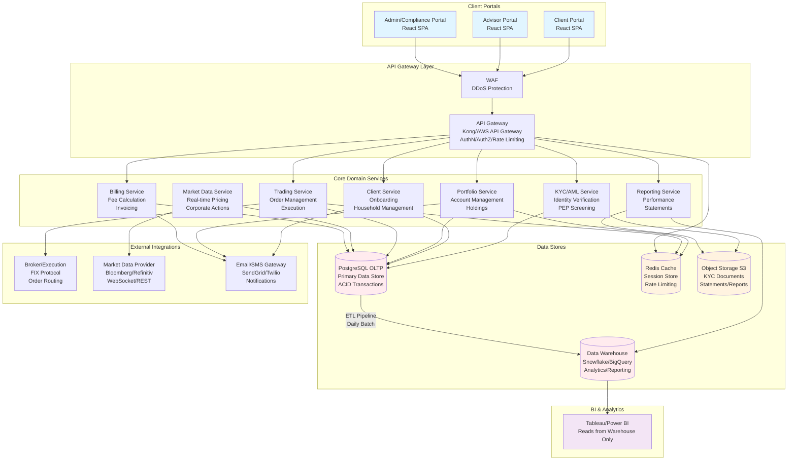
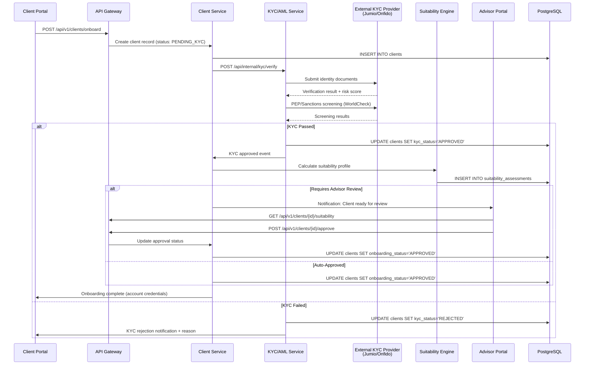
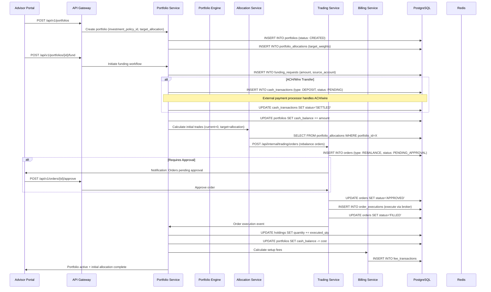
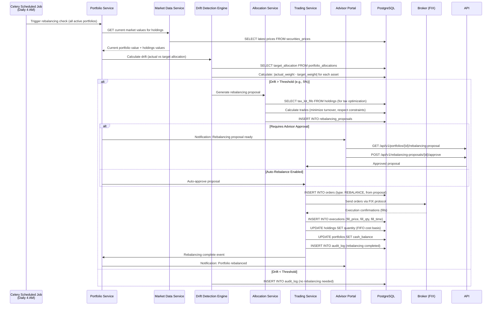
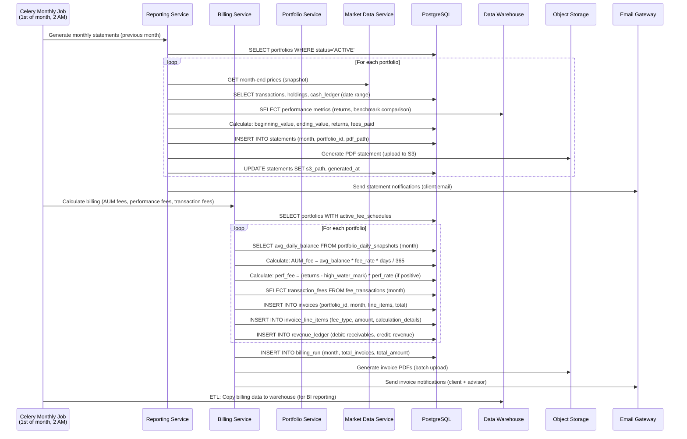

# Wealth Management Application - Production Architecture

## System Assumptions

- **Tech Stack**: Django REST Framework backend, React frontend, PostgreSQL OLTP, Snowflake/BigQuery data warehouse
- **Deployment**: AWS/Azure cloud-native, containerized (Docker/K8s)
- **Scale**: Multi-tenant (MSP model), ~10K clients, ~100 advisors, real-time pricing updates
- **Compliance**: SEC/FINRA regulated (US), GDPR compliant (EU clients), SOC 2 Type II
- **Integration**: FIX protocol for broker execution, REST APIs for market data (Bloomberg/Refinitiv)

---

## A) System Architecture Diagram



---

## B) Sequence Diagrams

### B.1 Client Onboarding (KYC + AML + Suitability Approval)



### B.2 Portfolio Creation + Funding + Initial Allocation



### B.3 Rebalancing Workflow



### B.4 Monthly Reporting + Billing Run



---

## C) App Modules

| Module | Responsibilities | Key Endpoints (REST) | Key Database Tables/Entities |
|--------|-----------------|---------------------|------------------------------|
| **KYC/AML** | Identity verification, PEP screening, document validation, risk scoring | `POST /api/v1/kyc/verify`<br/>`GET /api/v1/kyc/{client_id}/status`<br/>`POST /api/v1/kyc/{client_id}/documents`<br/>`GET /api/v1/kyc/{client_id}/screening-results` | `kyc_verifications`<br/>`kyc_documents`<br/>`pep_screening_results`<br/>`sanctions_matches`<br/>`risk_assessments` |
| **Client Management** | Onboarding, household management, advisor assignment, suitability assessment | `POST /api/v1/clients`<br/>`GET /api/v1/clients/{id}`<br/>`PUT /api/v1/clients/{id}`<br/>`POST /api/v1/clients/{id}/household`<br/>`GET /api/v1/clients/{id}/suitability`<br/>`POST /api/v1/clients/{id}/assign-advisor` | `clients`<br/>`households`<br/>`household_members`<br/>`advisor_assignments`<br/>`suitability_assessments`<br/>`client_preferences` |
| **Portfolio Management** | Account creation, holdings tracking, cash ledger, performance calculation | `POST /api/v1/portfolios`<br/>`GET /api/v1/portfolios/{id}`<br/>`GET /api/v1/portfolios/{id}/holdings`<br/>`GET /api/v1/portfolios/{id}/cash-ledger`<br/>`GET /api/v1/portfolios/{id}/performance`<br/>`POST /api/v1/portfolios/{id}/fund` | `portfolios`<br/>`accounts`<br/>`holdings`<br/>`tax_lots`<br/>`cash_transactions`<br/>`portfolio_daily_snapshots`<br/>`portfolio_allocations` |
| **Trading & Execution** | Order management, execution, trade settlement, position updates | `POST /api/v1/orders`<br/>`GET /api/v1/orders/{id}`<br/>`POST /api/v1/orders/{id}/cancel`<br/>`GET /api/v1/orders?portfolio_id=X&status=PENDING`<br/>`POST /api/internal/executions` (from broker) | `orders`<br/>`order_executions`<br/>`trades`<br/>`settlements`<br/>`order_routing_rules` |
| **Market Data** | Price ingestion, corporate actions, benchmark data, FX rates | `GET /api/v1/securities/{symbol}/price`<br/>`GET /api/v1/securities/{symbol}/prices?start_date=&end_date=`<br/>`GET /api/v1/benchmarks/{id}/values`<br/>`POST /api/internal/market-data/prices` (ingestion) | `securities`<br/>`securities_prices`<br/>`corporate_actions`<br/>`benchmarks`<br/>`benchmark_values`<br/>`fx_rates` |
| **Reporting** | Statement generation, performance reports, tax documents, compliance reports | `POST /api/v1/reports/statements`<br/>`GET /api/v1/reports/{id}/download`<br/>`GET /api/v1/portfolios/{id}/performance-report`<br/>`POST /api/v1/reports/tax-documents`<br/>`GET /api/v1/reports/compliance-summary` | `statements`<br/>`performance_reports`<br/>`tax_documents`<br/>`report_templates`<br/>`report_generation_jobs` |
| **Billing & Revenue** | Fee calculation, invoicing, payment processing, revenue recognition | `POST /api/v1/billing/runs`<br/>`GET /api/v1/invoices?portfolio_id=X`<br/>`GET /api/v1/invoices/{id}`<br/>`POST /api/v1/invoices/{id}/pay`<br/>`GET /api/v1/billing/fee-schedules` | `fee_schedules`<br/>`invoices`<br/>`invoice_line_items`<br/>`payments`<br/>`revenue_ledger`<br/>`billing_runs`<br/>`fee_transactions` |
| **User Management & Auth** | Authentication, authorization, RBAC, session management, MFA | `POST /api/v1/auth/login`<br/>`POST /api/v1/auth/logout`<br/>`POST /api/v1/auth/mfa/enable`<br/>`GET /api/v1/users/me`<br/>`GET /api/v1/users/{id}/permissions` | `users`<br/>`roles`<br/>`permissions`<br/>`role_permissions`<br/>`user_roles`<br/>`sessions`<br/>`mfa_devices`<br/>`access_tokens` |

---

## D) Core Data Model

### D.1 Users, Roles, Permissions

```python
# users/models.py
class User(AbstractUser):
    user_type = CharField(choices=['CLIENT', 'ADVISOR', 'ADMIN', 'COMPLIANCE'])
    is_active = BooleanField(default=True)
    mfa_enabled = BooleanField(default=False)
    last_login_ip = GenericIPAddressField(null=True)
    created_at = DateTimeField(auto_now_add=True)
    updated_at = DateTimeField(auto_now=True)

class Role(models.Model):
    name = CharField(max_length=100, unique=True)  # 'CLIENT', 'SENIOR_ADVISOR', 'COMPLIANCE_OFFICER'
    description = TextField()
    is_system_role = BooleanField(default=False)

class Permission(models.Model):
    name = CharField(max_length=200, unique=True)  # 'portfolio:view', 'trade:approve', 'client:kyc:view'
    resource = CharField(max_length=100)  # 'portfolio', 'trade', 'client'
    action = CharField(max_length=50)  # 'view', 'create', 'approve', 'delete'

class RolePermission(models.Model):
    role = ForeignKey(Role, on_delete=CASCADE)
    permission = ForeignKey(Permission, on_delete=CASCADE)
    constraints = JSONField(default=dict)  # Row-level: {"portfolio_id": "user.assigned_portfolios"}

class UserRole(models.Model):
    user = ForeignKey(User, on_delete=CASCADE)
    role = ForeignKey(Role, on_delete=CASCADE)
    assigned_by = ForeignKey(User, related_name='role_assignments')
    assigned_at = DateTimeField(auto_now_add=True)
    expires_at = DateTimeField(null=True)
```

### D.2 Client, Household, Advisor Assignment

```python
# clients/models.py
class Client(models.Model):
    user = OneToOneField(User, on_delete=CASCADE, related_name='client_profile')
    household = ForeignKey('Household', on_delete=SET_NULL, null=True)
    onboarding_status = CharField(choices=['PENDING_KYC', 'KYC_PENDING', 'APPROVED', 'REJECTED'])
    kyc_status = CharField(choices=['PENDING', 'APPROVED', 'REJECTED', 'EXPIRED'])
    risk_tolerance = CharField(choices=['CONSERVATIVE', 'MODERATE', 'AGGRESSIVE'])
    investment_experience = IntegerField()  # Years
    annual_income_min = DecimalField(max_digits=15, decimal_places=2)
    net_worth_min = DecimalField(max_digits=15, decimal_places=2)
    created_at = DateTimeField(auto_now_add=True)

class Household(models.Model):
    primary_client = ForeignKey(Client, related_name='primary_household', on_delete=CASCADE)
    household_name = CharField(max_length=255)
    tax_id = CharField(max_length=50, unique=True)  # SSN/EIN
    created_at = DateTimeField(auto_now_add=True)

class HouseholdMember(models.Model):
    household = ForeignKey(Household, on_delete=CASCADE, related_name='members')
    client = ForeignKey(Client, on_delete=CASCADE)
    relationship = CharField(choices=['SPOUSE', 'CHILD', 'DEPENDENT', 'OTHER'])

class AdvisorAssignment(models.Model):
    client = ForeignKey(Client, on_delete=CASCADE, related_name='advisor_assignments')
    advisor = ForeignKey(User, limit_choices_to={'user_type': 'ADVISOR'}, on_delete=CASCADE)
    assignment_type = CharField(choices=['PRIMARY', 'SUPPORTING', 'SUPERVISOR'])
    assigned_at = DateTimeField(auto_now_add=True)
    assigned_by = ForeignKey(User, related_name='assignment_actions')
    is_active = BooleanField(default=True)
```

### D.3 KYC/AML/Suitability + Approval Trail

```python
# kyc/models.py
class KYCVerification(models.Model):
    client = ForeignKey(Client, on_delete=CASCADE, related_name='kyc_verifications')
    verification_status = CharField(choices=['PENDING', 'IN_PROGRESS', 'APPROVED', 'REJECTED', 'EXPIRED'])
    provider = CharField(max_length=100)  # 'JUMIO', 'ONFIDO', 'MANUAL'
    provider_reference = CharField(max_length=255)
    risk_score = IntegerField(null=True)  # 0-100
    verified_at = DateTimeField(null=True)
    expires_at = DateTimeField(null=True)
    rejection_reason = TextField(null=True)

class KYCDocument(models.Model):
    kyc_verification = ForeignKey(KYCVerification, on_delete=CASCADE, related_name='documents')
    document_type = CharField(choices=['PASSPORT', 'DRIVERS_LICENSE', 'UTILITY_BILL', 'BANK_STATEMENT'])
    s3_path = CharField(max_length=500)
    uploaded_at = DateTimeField(auto_now_add=True)
    verified = BooleanField(default=False)

class PEPScreening(models.Model):
    client = ForeignKey(Client, on_delete=CASCADE, related_name='pep_screenings')
    screening_date = DateTimeField(auto_now_add=True)
    provider = CharField(max_length=100)  # 'WORLDCHECK', 'DOW_JONES'
    matches_found = BooleanField(default=False)
    risk_level = CharField(choices=['LOW', 'MEDIUM', 'HIGH'], null=True)
    details = JSONField(default=dict)

class SuitabilityAssessment(models.Model):
    client = ForeignKey(Client, on_delete=CASCADE, related_name='suitability_assessments')
    assessment_date = DateTimeField(auto_now_add=True)
    risk_tolerance_score = IntegerField()  # 1-10
    investment_objective = CharField(choices=['INCOME', 'GROWTH', 'BALANCED', 'PRESERVATION'])
    time_horizon_years = IntegerField()
    liquidity_needs = CharField(choices=['HIGH', 'MEDIUM', 'LOW'])
    approved_by = ForeignKey(User, null=True, on_delete=SET_NULL)
    approved_at = DateTimeField(null=True)
    status = CharField(choices=['PENDING', 'APPROVED', 'REJECTED'])

class ApprovalTrail(models.Model):
    entity_type = CharField(max_length=50)  # 'CLIENT', 'ORDER', 'PORTFOLIO'
    entity_id = BigIntegerField()
    action = CharField(max_length=100)  # 'ONBOARDING_APPROVED', 'ORDER_APPROVED'
    approved_by = ForeignKey(User, on_delete=SET_NULL, null=True)
    approved_at = DateTimeField(auto_now_add=True)
    rejection_reason = TextField(null=True)
    previous_status = CharField(max_length=50)
    new_status = CharField(max_length=50)
    metadata = JSONField(default=dict)
```

### D.4 Portfolio, Account, Holdings, Transactions, Cash Ledger

```python
# portfolios/models.py
class Portfolio(models.Model):
    client = ForeignKey(Client, on_delete=CASCADE, related_name='portfolios')
    portfolio_name = CharField(max_length=255)
    portfolio_type = CharField(choices=['INDIVIDUAL', 'JOINT', 'IRA', 'TRUST', 'CORPORATE'])
    status = CharField(choices=['CREATED', 'FUNDING', 'ACTIVE', 'CLOSED', 'SUSPENDED'])
    base_currency = CharField(max_length=3, default='USD')
    created_at = DateTimeField(auto_now_add=True)
    closed_at = DateTimeField(null=True)

class Account(models.Model):
    portfolio = ForeignKey(Portfolio, on_delete=CASCADE, related_name='accounts')
    account_number = CharField(max_length=50, unique=True)
    account_type = CharField(choices=['TAXABLE', 'IRA_TRADITIONAL', 'IRA_ROTH', '401K', 'TRUST'])
    custodian = CharField(max_length=100)  # Broker name
    status = CharField(choices=['ACTIVE', 'CLOSED', 'TRANSFERRED'])
    opened_at = DateTimeField(auto_now_add=True)

class Security(models.Model):
    symbol = CharField(max_length=20, unique=True, db_index=True)
    cusip = CharField(max_length=9, null=True, unique=True)
    isin = CharField(max_length=12, null=True)
    name = CharField(max_length=255)
    asset_class = CharField(choices=['EQUITY', 'FIXED_INCOME', 'ETF', 'MUTUAL_FUND', 'CASH', 'ALTERNATIVE'])
    currency = CharField(max_length=3, default='USD')
    is_active = BooleanField(default=True)
    created_at = DateTimeField(auto_now_add=True)

class Holding(models.Model):
    portfolio = ForeignKey(Portfolio, on_delete=CASCADE, related_name='holdings')
    security = ForeignKey(Security, on_delete=CASCADE)
    quantity = DecimalField(max_digits=20, decimal_places=8)
    cost_basis = DecimalField(max_digits=20, decimal_places=2)  # Total cost
    last_updated = DateTimeField(auto_now=True)

class TaxLot(models.Model):
    holding = ForeignKey(Holding, on_delete=CASCADE, related_name='tax_lots')
    quantity = DecimalField(max_digits=20, decimal_places=8)
    cost_per_share = DecimalField(max_digits=20, decimal_places=6)
    acquisition_date = DateField()
    trade_id = ForeignKey('Trade', on_delete=SET_NULL, null=True)  # Source trade

class CashTransaction(models.Model):
    portfolio = ForeignKey(Portfolio, on_delete=CASCADE, related_name='cash_transactions')
    transaction_type = CharField(choices=['DEPOSIT', 'WITHDRAWAL', 'FEE', 'INTEREST', 'DIVIDEND'])
    amount = DecimalField(max_digits=20, decimal_places=2)
    currency = CharField(max_length=3, default='USD')
    status = CharField(choices=['PENDING', 'SETTLED', 'FAILED', 'CANCELLED'])
    transaction_date = DateField()
    settled_date = DateField(null=True)
    reference_number = CharField(max_length=255, null=True)  # ACH/wire reference
    created_at = DateTimeField(auto_now_add=True)

class PortfolioDailySnapshot(models.Model):
    portfolio = ForeignKey(Portfolio, on_delete=CASCADE, related_name='daily_snapshots')
    snapshot_date = DateField(db_index=True)
    total_value = DecimalField(max_digits=20, decimal_places=2)
    cash_balance = DecimalField(max_digits=20, decimal_places=2)
    invested_value = DecimalField(max_digits=20, decimal_places=2)
    daily_return = DecimalField(max_digits=10, decimal_places=6, null=True)
    created_at = DateTimeField(auto_now_add=True)
    class Meta:
        unique_together = ['portfolio', 'snapshot_date']
        indexes = [models.Index(fields=['portfolio', 'snapshot_date'])]

class PortfolioAllocation(models.Model):
    portfolio = ForeignKey(Portfolio, on_delete=CASCADE, related_name='allocations')
    security = ForeignKey(Security, on_delete=CASCADE, null=True)  # NULL for cash allocation
    asset_class = CharField(max_length=50)  # 'EQUITY', 'FIXED_INCOME', 'CASH'
    target_weight = DecimalField(max_digits=5, decimal_places=4)  # 0.0000-1.0000
    min_weight = DecimalField(max_digits=5, decimal_places=4, null=True)
    max_weight = DecimalField(max_digits=5, decimal_places=4, null=True)
    rebalance_threshold = DecimalField(max_digits=5, decimal_places=4, default=0.05)  # 5% drift
```

### D.5 Orders, Trades, Executions

```python
# trading/models.py
class Order(models.Model):
    portfolio = ForeignKey(Portfolio, on_delete=CASCADE, related_name='orders')
    security = ForeignKey(Security, on_delete=CASCADE)
    order_type = CharField(choices=['MARKET', 'LIMIT', 'STOP', 'STOP_LIMIT'])
    side = CharField(choices=['BUY', 'SELL'])
    quantity = DecimalField(max_digits=20, decimal_places=8)
    limit_price = DecimalField(max_digits=20, decimal_places=6, null=True)
    stop_price = DecimalField(max_digits=20, decimal_places=6, null=True)
    status = CharField(choices=['PENDING_APPROVAL', 'APPROVED', 'SENT', 'PARTIAL_FILL', 'FILLED', 'CANCELLED', 'REJECTED'])
    order_source = CharField(choices=['REBALANCE', 'MANUAL', 'DRIP', 'AUTO_INVEST'])
    approved_by = ForeignKey(User, null=True, on_delete=SET_NULL)
    approved_at = DateTimeField(null=True)
    created_at = DateTimeField(auto_now_add=True)
    filled_at = DateTimeField(null=True)

class OrderExecution(models.Model):
    order = ForeignKey(Order, on_delete=CASCADE, related_name='executions')
    fill_quantity = DecimalField(max_digits=20, decimal_places=8)
    fill_price = DecimalField(max_digits=20, decimal_places=6)
    fill_time = DateTimeField()
    execution_id = CharField(max_length=255, unique=True)  # Broker execution ID
    commission = DecimalField(max_digits=10, decimal_places=2, default=0)
    fees = DecimalField(max_digits=10, decimal_places=2, default=0)

class Trade(models.Model):
    portfolio = ForeignKey(Portfolio, on_delete=CASCADE, related_name='trades')
    order_execution = OneToOneField(OrderExecution, on_delete=CASCADE)
    security = ForeignKey(Security, on_delete=CASCADE)
    trade_date = DateField()
    settlement_date = DateField()
    quantity = DecimalField(max_digits=20, decimal_places=8)
    price = DecimalField(max_digits=20, decimal_places=6)
    principal = DecimalField(max_digits=20, decimal_places=2)  # quantity * price
    commission = DecimalField(max_digits=10, decimal_places=2)
    net_amount = DecimalField(max_digits=20, decimal_places=2)  # principal + commission (signed)
    created_at = DateTimeField(auto_now_add=True)
```

### D.6 Securities, Prices, FX, Benchmarks

```python
# market_data/models.py
class SecurityPrice(models.Model):
    security = ForeignKey(Security, on_delete=CASCADE, related_name='prices')
    price_date = DateField(db_index=True)
    open_price = DecimalField(max_digits=20, decimal_places=6)
    high_price = DecimalField(max_digits=20, decimal_places=6)
    low_price = DecimalField(max_digits=20, decimal_places=6)
    close_price = DecimalField(max_digits=20, decimal_places=6)
    volume = BigIntegerField(null=True)
    adjusted_close = DecimalField(max_digits=20, decimal_places=6, null=True)  # Adjusted for splits
    data_source = CharField(max_length=100)  # 'BLOOMBERG', 'REFINITIV', 'MANUAL'
    ingested_at = DateTimeField(auto_now_add=True)
    class Meta:
        unique_together = ['security', 'price_date']
        indexes = [models.Index(fields=['security', '-price_date'])]

class CorporateAction(models.Model):
    security = ForeignKey(Security, on_delete=CASCADE, related_name='corporate_actions')
    action_type = CharField(choices=['DIVIDEND', 'SPLIT', 'SPINOFF', 'MERGER', 'RIGHTS_OFFERING'])
    ex_date = DateField()
    record_date = DateField()
    payment_date = DateField(null=True)
    details = JSONField(default=dict)  # e.g., split_ratio, dividend_per_share

class FXRate(models.Model):
    from_currency = CharField(max_length=3)
    to_currency = CharField(max_length=3)
    rate_date = DateField(db_index=True)
    rate = DecimalField(max_digits=20, decimal_places=8)
    data_source = CharField(max_length=100)
    class Meta:
        unique_together = [['from_currency', 'to_currency', 'rate_date']]

class Benchmark(models.Model):
    name = CharField(max_length=255)  # 'S&P 500', 'MSCI World'
    symbol = CharField(max_length=50, unique=True)
    benchmark_type = CharField(choices=['INDEX', 'CUSTOM', 'PEER_GROUP'])

class BenchmarkValue(models.Model):
    benchmark = ForeignKey(Benchmark, on_delete=CASCADE, related_name='values')
    value_date = DateField(db_index=True)
    value = DecimalField(max_digits=20, decimal_places=6)
    return_pct = DecimalField(max_digits=10, decimal_places=6, null=True)  # Daily return
    class Meta:
        unique_together = ['benchmark', 'value_date']
```

### D.7 Fees, Invoices, Payments, Revenue Ledger

```python
# billing/models.py
class FeeSchedule(models.Model):
    portfolio = ForeignKey(Portfolio, on_delete=CASCADE, related_name='fee_schedules')
    fee_type = CharField(choices=['AUM', 'PERFORMANCE', 'TRANSACTION', 'CUSTODIAL'])
    fee_rate = DecimalField(max_digits=8, decimal_places=6)  # Annual rate (e.g., 0.0125 = 1.25%)
    tier_start = DecimalField(max_digits=20, decimal_places=2, null=True)  # Fee tiering
    tier_end = DecimalField(max_digits=20, decimal_places=2, null=True)
    high_water_mark = DecimalField(max_digits=20, decimal_places=2, null=True)  # For perf fees
    is_active = BooleanField(default=True)
    effective_date = DateField()
    expires_date = DateField(null=True)

class Invoice(models.Model):
    portfolio = ForeignKey(Portfolio, on_delete=CASCADE, related_name='invoices')
    invoice_number = CharField(max_length=50, unique=True)
    invoice_date = DateField()
    due_date = DateField()
    period_start = DateField()
    period_end = DateField()
    subtotal = DecimalField(max_digits=20, decimal_places=2)
    tax = DecimalField(max_digits=20, decimal_places=2, default=0)
    total = DecimalField(max_digits=20, decimal_places=2)
    status = CharField(choices=['DRAFT', 'ISSUED', 'PAID', 'OVERDUE', 'CANCELLED'])
    s3_path = CharField(max_length=500, null=True)  # PDF invoice
    created_at = DateTimeField(auto_now_add=True)

class InvoiceLineItem(models.Model):
    invoice = ForeignKey(Invoice, on_delete=CASCADE, related_name='line_items')
    fee_type = CharField(max_length=50)
    description = TextField()
    quantity = DecimalField(max_digits=20, decimal_places=8, default=1)
    unit_price = DecimalField(max_digits=20, decimal_places=2)
    amount = DecimalField(max_digits=20, decimal_places=2)
    calculation_details = JSONField(default=dict)  # For audit: {"avg_balance": 1000000, "days": 30, "rate": 0.0125}

class Payment(models.Model):
    invoice = ForeignKey(Invoice, on_delete=CASCADE, related_name='payments')
    payment_method = CharField(choices=['ACH', 'WIRE', 'CHECK', 'CREDIT_CARD'])
    amount = DecimalField(max_digits=20, decimal_places=2)
    payment_date = DateField()
    reference_number = CharField(max_length=255, null=True)
    status = CharField(choices=['PENDING', 'PROCESSING', 'COMPLETED', 'FAILED'])
    processed_at = DateTimeField(null=True)

class RevenueLedger(models.Model):
    """Double-entry accounting: debits and credits"""
    portfolio = ForeignKey(Portfolio, on_delete=CASCADE, null=True)  # NULL for non-portfolio revenue
    invoice = ForeignKey(Invoice, on_delete=SET_NULL, null=True)
    entry_date = DateField()
    account = CharField(max_length=50)  # 'ACCOUNTS_RECEIVABLE', 'REVENUE_AUM', 'REVENUE_PERFORMANCE'
    entry_type = CharField(choices=['DEBIT', 'CREDIT'])
    amount = DecimalField(max_digits=20, decimal_places=2)
    description = TextField()
    created_at = DateTimeField(auto_now_add=True)

class FeeTransaction(models.Model):
    portfolio = ForeignKey(Portfolio, on_delete=CASCADE, related_name='fee_transactions')
    fee_type = CharField(max_length=50)
    amount = DecimalField(max_digits=20, decimal_places=2)
    transaction_date = DateField()
    calculation_period_start = DateField()
    calculation_period_end = DateField()
    fee_schedule = ForeignKey(FeeSchedule, on_delete=SET_NULL, null=True)
    invoice_line_item = ForeignKey(InvoiceLineItem, on_delete=SET_NULL, null=True)
```

### D.8 Audit Log (Immutable)

```python
# audit/models.py
class AuditLog(models.Model):
    """Immutable audit trail for all critical actions"""
    timestamp = DateTimeField(auto_now_add=True, db_index=True)
    user = ForeignKey(User, on_delete=SET_NULL, null=True)
    action = CharField(max_length=100)  # 'CLIENT_CREATED', 'ORDER_APPROVED', 'PORTFOLIO_REBALANCED'
    entity_type = CharField(max_length=50)  # 'Client', 'Order', 'Portfolio'
    entity_id = BigIntegerField(db_index=True)
    ip_address = GenericIPAddressField(null=True)
    user_agent = TextField(null=True)
    changes = JSONField(default=dict)  # Before/after snapshot for updates
    metadata = JSONField(default=dict)  # Additional context
    class Meta:
        indexes = [
            models.Index(fields=['entity_type', 'entity_id', '-timestamp']),
            models.Index(fields=['user', '-timestamp']),
            models.Index(fields=['-timestamp']),
        ]
```

---

## E) Security & Compliance Design

### E.1 RBAC + Row-Level Access Rules

**Role-Based Access Control:**
- **System Roles**: `CLIENT`, `ADVISOR`, `SENIOR_ADVISOR`, `COMPLIANCE_OFFICER`, `ADMIN`, `READONLY_AUDITOR`
- **Permission Format**: `{resource}:{action}` (e.g., `portfolio:view`, `trade:approve`, `client:kyc:view_all`)
- **Row-Level Security (RLS)**:
  - Clients: `portfolio.client.user_id = request.user.id` (enforced in queryset filters)
  - Advisors: `portfolio.client.advisor_assignments.filter(advisor=request.user, is_active=True).exists()`
  - Compliance: Full access to all entities (audit-only, no modifications)
- **Implementation**: Django `get_queryset()` override in ViewSets + `Permission` model with `constraints` JSONField

**Data Access Patterns:**
```python
# Example: PortfolioViewSet
def get_queryset(self):
    qs = Portfolio.objects.select_related('client')
    if self.request.user.user_type == 'CLIENT':
        return qs.filter(client__user=self.request.user)
    elif self.request.user.user_type == 'ADVISOR':
        return qs.filter(client__advisor_assignments__advisor=self.request.user, 
                        client__advisor_assignments__is_active=True)
    elif self.request.user.has_perm('portfolio:view_all'):
        return qs  # Admin/Compliance
    return qs.none()
```

### E.2 MFA + Session Management

**Multi-Factor Authentication:**
- **MFA Methods**: TOTP (Google Authenticator), SMS OTP, Email OTP, Hardware tokens (YubiKey)
- **Enforcement**: Required for advisors/admin, optional for clients
- **Storage**: Encrypted TOTP secrets in `mfa_devices` table (AES-256)
- **Rate Limiting**: Max 5 MFA attempts per 15 minutes, account lockout after 10 failures

**Session Management:**
- **Session Store**: Redis (expires after 24h inactivity, 7d absolute max)
- **Session Security**: HttpOnly, Secure, SameSite=Strict cookies, JWT tokens for API
- **Concurrent Sessions**: Max 3 concurrent sessions per user (enforced in middleware)
- **Session Revocation**: Admin can revoke all sessions (e.g., security incident)

### E.3 Encryption in Transit/At Rest

**In Transit:**
- **TLS 1.3** for all HTTP/HTTPS traffic (API, portals)
- **FIX Protocol**: TLS for broker connections
- **Database**: PostgreSQL SSL connections required (`sslmode=require`)
- **Internal Service Communication**: mTLS for service-to-service (API Gateway → Services)

**At Rest:**
- **Database Encryption**: PostgreSQL TDE (Transparent Data Encryption) or AWS RDS encryption-at-rest
- **PII Fields**: AES-256 encryption for `client.tax_id`, `client.ssn`, `kyc_documents.s3_path`
- **S3 Objects**: Server-side encryption (SSE-S3) + bucket-level encryption policy
- **Backup Encryption**: Encrypted database backups (AES-256) with separate key management (AWS KMS)

**Key Management:**
- **Secrets**: AWS Secrets Manager / HashiCorp Vault
- **Encryption Keys**: Rotated every 90 days (automated)
- **Key Access**: Least-privilege IAM roles, audit logging for key usage

### E.4 Audit Logging Requirements

**Immutable Audit Trail:**
- **Table**: `audit_log` (append-only, no UPDATE/DELETE)
- **Logging Triggers**: All CREATE/UPDATE/DELETE on entities (`Client`, `Portfolio`, `Order`, `Invoice`, `KYCVerification`)
- **Logged Fields**: `timestamp`, `user`, `action`, `entity_type`, `entity_id`, `ip_address`, `user_agent`, `changes` (before/after), `metadata`
- **Retention**: 7 years (SEC/FINRA requirement), archived to cold storage after 2 years

**Logging Implementation:**
```python
# Django signals for automatic audit logging
@receiver(post_save, sender=Portfolio)
def log_portfolio_changes(sender, instance, created, **kwargs):
    if created:
        action = 'PORTFOLIO_CREATED'
        changes = {'id': instance.id, 'name': instance.portfolio_name}
    else:
        action = 'PORTFOLIO_UPDATED'
        changes = {'id': instance.id, 'updated_fields': list(kwargs.get('update_fields', []))}
    
    AuditLog.objects.create(
        user=get_current_user(),  # Thread-local or request context
        action=action,
        entity_type='Portfolio',
        entity_id=instance.id,
        changes=changes
    )
```

**Compliance Reporting:**
- **Access Logs**: Who accessed what client data, when (from `audit_log` + API Gateway logs)
- **Change History**: Full before/after snapshots for client records, portfolios, orders
- **Export**: CSV/JSON export for compliance audits (filtered by date range, entity type)

### E.5 Document Storage Access Controls

**S3 Bucket Structure:**
```
s3://wealth-mgmt-docs/
  ├── kyc/{client_id}/{document_type}/{filename}
  ├── statements/{portfolio_id}/{year}/{month}/statement.pdf
  ├── invoices/{portfolio_id}/{year}/{invoice_number}.pdf
  └── tax-documents/{client_id}/{year}/{form_type}.pdf
```

**Access Control:**
- **Presigned URLs**: Time-limited (15 minutes), role-based (clients see only their docs, advisors see assigned clients)
- **Bucket Policy**: Deny public access, require authenticated requests
- **IAM Roles**: Service-specific roles with least-privilege S3 access
- **Object Metadata**: Encrypted client_id, portfolio_id for access validation

**Implementation:**
```python
def generate_presigned_url(s3_path, user, expires_in=900):
    # Verify user has permission to access this document
    if not has_document_access(user, s3_path):
        raise PermissionDenied
    
    s3_client = boto3.client('s3')
    return s3_client.generate_presigned_url(
        'get_object',
        Params={'Bucket': 'wealth-mgmt-docs', 'Key': s3_path},
        ExpiresIn=expires_in
    )
```

### E.6 Data Retention Notes

| Data Type | Retention Period | Archival Strategy | Deletion Rules |
|-----------|----------------|-------------------|----------------|
| **Client Records** | 7 years after account closure | Archive to cold storage after 2 years | Soft delete only (mark as deleted, retain for audit) |
| **KYC Documents** | 7 years | S3 Glacier after 2 years | Never hard delete (compliance requirement) |
| **Trade/Order Records** | 7 years | Warehouse archive after 1 year | Immutable (no deletion) |
| **Audit Logs** | 7 years | Cold storage after 2 years | Append-only, no deletion |
| **Statements/Reports** | 7 years | S3 Glacier after 1 year | Client-requested deletion after 7 years |
| **Market Data Prices** | Permanent | Warehouse (OLTP → Warehouse ETL) | Keep for backtesting, performance attribution |
| **Session Data** | 30 days | None (Redis expires) | Auto-delete after expiry |
| **API Gateway Logs** | 90 days | CloudWatch Logs → S3 after 30 days | Auto-delete after 90 days |

**GDPR Compliance (EU Clients):**
- **Right to Erasure**: Soft delete client records (anonymize PII, retain transaction history for regulatory compliance)
- **Data Portability**: Export all client data in JSON/CSV format (via API endpoint)
- **Consent Management**: Track consent for data processing, marketing communications

---

## F) Engineering Structure

### F.1 Django Project Layout

```
wealth_mgmt/
├── config/
│   ├── settings/
│   │   ├── base.py
│   │   ├── local.py
│   │   ├── staging.py
│   │   └── production.py
│   ├── urls.py
│   └── wsgi.py
│
├── apps/
│   ├── kyc/
│   │   ├── models.py (KYCVerification, KYCDocument, PEPScreening)
│   │   ├── serializers.py
│   │   ├── views.py (ViewSets)
│   │   ├── services.py (KYCService, ScreeningService)
│   │   ├── repositories.py (KYCRepository)
│   │   ├── tasks.py (Celery: async screening)
│   │   └── integrations.py (JumioClient, WorldCheckClient)
│   │
│   ├── clients/
│   │   ├── models.py (Client, Household, AdvisorAssignment, SuitabilityAssessment)
│   │   ├── serializers.py
│   │   ├── views.py
│   │   ├── services.py (ClientService, HouseholdService, SuitabilityService)
│   │   └── repositories.py
│   │
│   ├── portfolios/
│   │   ├── models.py (Portfolio, Account, Holding, TaxLot, PortfolioAllocation)
│   │   ├── serializers.py
│   │   ├── views.py
│   │   ├── services.py (PortfolioService, HoldingsService, PerformanceService)
│   │   ├── repositories.py
│   │   └── calculators.py (PerformanceCalculator, AttributionCalculator)
│   │
│   ├── trading/
│   │   ├── models.py (Order, OrderExecution, Trade)
│   │   ├── serializers.py
│   │   ├── views.py
│   │   ├── services.py (OrderService, ExecutionService, RebalancingService)
│   │   ├── repositories.py
│   │   ├── integrations.py (FIXBrokerClient)
│   │   └── validators.py (OrderValidator, ComplianceValidator)
│   │
│   ├── market_data/
│   │   ├── models.py (Security, SecurityPrice, CorporateAction, Benchmark, FXRate)
│   │   ├── serializers.py
│   │   ├── views.py
│   │   ├── services.py (PriceIngestionService, CorporateActionsService)
│   │   ├── repositories.py
│   │   ├── integrations.py (BloombergClient, RefinitivClient)
│   │   └── tasks.py (Celery: price ingestion, corporate actions)
│   │
│   ├── reporting/
│   │   ├── models.py (Statement, PerformanceReport, TaxDocument)
│   │   ├── serializers.py
│   │   ├── views.py
│   │   ├── services.py (StatementService, ReportGeneratorService)
│   │   ├── generators.py (PDFGenerator, ExcelGenerator)
│   │   └── tasks.py (Celery: statement generation, report batch jobs)
│   │
│   ├── billing/
│   │   ├── models.py (FeeSchedule, Invoice, Payment, RevenueLedger)
│   │   ├── serializers.py
│   │   ├── views.py
│   │   ├── services.py (FeeCalculationService, InvoicingService, PaymentService)
│   │   ├── calculators.py (AUMFeeCalculator, PerformanceFeeCalculator)
│   │   └── tasks.py (Celery: monthly billing run)
│   │
│   ├── users/
│   │   ├── models.py (User, Role, Permission, UserRole, Session, MFADevice)
│   │   ├── serializers.py
│   │   ├── views.py (AuthViewSet, UserViewSet)
│   │   ├── services.py (AuthService, PermissionService, MFAService)
│   │   └── middleware.py (RowLevelSecurityMiddleware)
│   │
│   └── audit/
│       ├── models.py (AuditLog)
│       ├── signals.py (post_save handlers for all entities)
│       ├── services.py (AuditService)
│       └── middleware.py (AuditMiddleware - capture request context)
│
├── services/  # Shared business logic
│   ├── allocation_service.py (RebalancingEngine, DriftDetector)
│   ├── performance_service.py (ReturnsCalculator, BenchmarkComparison)
│   └── compliance_service.py (TradeComplianceChecker, SuitabilityValidator)
│
├── integrations/  # External API clients
│   ├── brokers/
│   │   ├── fix_client.py (FIX protocol wrapper)
│   │   └── rest_broker_client.py (REST API broker)
│   ├── market_data/
│   │   ├── bloomberg_client.py
│   │   └── refinitiv_client.py
│   └── kyc_providers/
│       ├── jumio_client.py
│       └── worldcheck_client.py
│
├── repositories/  # Data access layer (optional, if using Repository pattern)
│   ├── base_repository.py
│   ├── client_repository.py
│   └── portfolio_repository.py
│
├── utils/
│   ├── permissions.py (Permission helpers, RLS filters)
│   ├── encryption.py (PII encryption/decryption)
│   ├── s3_utils.py (Presigned URL generation, document upload)
│   └── date_utils.py (Business day calculation, settlement dates)
│
├── celery_app/
│   ├── celery.py
│   ├── beat_schedule.py  # Periodic task schedule
│   └── tasks/  # Shared Celery tasks
│       ├── etl_tasks.py (OLTP → Warehouse ETL)
│       └── notification_tasks.py (Email/SMS sending)
│
└── tests/
    ├── unit/
    │   ├── test_kyc_service.py
    │   ├── test_portfolio_service.py
    │   └── test_fee_calculator.py
    ├── integration/
    │   ├── test_client_onboarding_flow.py
    │   ├── test_rebalancing_workflow.py
    │   └── test_billing_run.py
    └── fixtures/
        ├── test_clients.json
        └── test_securities.json
```

### F.2 Background Jobs (Celery Schedule)

| Job Name | Schedule | Task Function | Purpose | Dependencies |
|----------|----------|---------------|---------|--------------|
| **market_data_price_ingestion** | Every 5 minutes (market hours) | `market_data.tasks.ingest_prices()` | Fetch latest prices from Bloomberg/Refinitiv, update `securities_prices` | Market data provider API |
| **corporate_actions_ingestion** | Daily 6 AM | `market_data.tasks.ingest_corporate_actions()` | Update corporate actions (dividends, splits) | Market data provider |
| **portfolio_daily_snapshot** | Daily 4:30 PM (after market close) | `portfolios.tasks.generate_daily_snapshots()` | Calculate portfolio values, store in `portfolio_daily_snapshots` | Market data prices |
| **drift_detection_rebalancing** | Daily 4 AM | `trading.tasks.detect_drift_and_rebalance()` | Check drift, generate proposals, execute if auto-rebalance enabled | Portfolio snapshots, allocations |
| **statement_generation** | 1st of month, 2 AM | `reporting.tasks.generate_monthly_statements()` | Generate PDF statements for previous month, upload to S3, send emails | Portfolio snapshots, transactions |
| **billing_run** | 1st of month, 3 AM | `billing.tasks.monthly_billing_run()` | Calculate fees, generate invoices, update revenue ledger | Portfolio snapshots, fee schedules |
| **kyc_expiry_check** | Daily 8 AM | `kyc.tasks.check_kyc_expiry()` | Notify clients/advisors of expiring KYC, auto-suspend if expired | KYC verification records |
| **etl_oltp_to_warehouse** | Daily 1 AM | `celery_app.tasks.etl_tasks.sync_to_warehouse()` | Copy transactional data to data warehouse for BI | All OLTP tables |
| **audit_log_archival** | Weekly (Sunday 2 AM) | `audit.tasks.archive_old_logs()` | Move audit logs older than 2 years to cold storage | Audit log table |
| **performance_calculation** | Daily 5 PM | `portfolios.tasks.calculate_performance_metrics()` | Compute returns, Sharpe ratio, benchmark comparison | Portfolio snapshots, benchmark values |

**Celery Beat Configuration:**
```python
# celery_app/beat_schedule.py
from celery.schedules import crontab

CELERY_BEAT_SCHEDULE = {
    'market-data-ingestion': {
        'task': 'market_data.tasks.ingest_prices',
        'schedule': crontab(minute='*/5', hour='9-16'),  # Market hours only
        'options': {'queue': 'market_data'}
    },
    'daily-snapshot': {
        'task': 'portfolios.tasks.generate_daily_snapshots',
        'schedule': crontab(hour=16, minute=30),  # 4:30 PM
        'options': {'queue': 'portfolios'}
    },
    'monthly-billing': {
        'task': 'billing.tasks.monthly_billing_run',
        'schedule': crontab(day_of_month=1, hour=3, minute=0),
        'options': {'queue': 'billing'}
    },
    # ... other schedules
}
```

### F.3 Testing Strategy

**Unit Tests:**
- **Scope**: Services, calculators, validators, repositories (business logic only)
- **Framework**: pytest + pytest-django
- **Coverage Target**: ≥80% for services/calculators
- **Examples**:
  - `test_fee_calculator.py`: AUM fee calculation, performance fee with high-water mark
  - `test_rebalancing_engine.py`: Drift detection, trade generation, tax optimization
  - `test_performance_calculator.py`: Time-weighted returns, benchmark attribution

**Integration Tests:**
- **Scope**: End-to-end workflows (onboarding, rebalancing, billing), API endpoints
- **Framework**: pytest + Django TestCase, test database (PostgreSQL)
- **Coverage**: All critical workflows (onboarding, trading, billing)
- **Examples**:
  - `test_client_onboarding_flow.py`: KYC → Suitability → Approval → Portfolio creation
  - `test_rebalancing_workflow.py`: Drift detection → Proposal → Approval → Execution → Holdings update
  - `test_billing_run.py`: Fee calculation → Invoice generation → Payment processing

**Data Validation Tests:**
- **Scope**: Data integrity, referential integrity, business rules
- **Framework**: pytest + custom validators
- **Examples**:
  - `test_data_integrity.py`: Portfolio value = sum(holdings) + cash_balance, Order fill quantity ≤ order quantity
  - `test_business_rules.py`: Rebalancing threshold validation, fee tier boundaries, tax lot FIFO consistency

**Performance Tests:**
- **Scope**: Query performance (N+1 prevention), API response times, batch job execution time
- **Framework**: pytest-benchmark, Django Debug Toolbar
- **Targets**: API endpoints <200ms (p95), batch jobs complete within SLA windows

---

## Production Deployment Considerations

**Infrastructure:**
- **Application Servers**: 3+ instances (ASG, health checks)
- **Database**: PostgreSQL RDS Multi-AZ (primary + standby), read replicas for reporting
- **Cache**: Redis Cluster (ElastiCache)
- **Queue**: RabbitMQ or AWS SQS for Celery
- **Storage**: S3 for documents, Glacier for archival
- **CDN**: CloudFront for static assets, API response caching

**Monitoring & Observability:**
- **APM**: Datadog/New Relic (application performance monitoring)
- **Logging**: ELK Stack (Elasticsearch, Logstash, Kibana) or CloudWatch Logs
- **Metrics**: Prometheus + Grafana (custom business metrics: portfolio count, AUM, trade volume)
- **Alerts**: PagerDuty for critical issues (database down, billing job failure, market data ingestion failure)

**Disaster Recovery:**
- **RTO**: 4 hours (Recovery Time Objective)
- **RPO**: 1 hour (Recovery Point Objective - max data loss)
- **Backup Strategy**: Daily full backups, hourly incremental, cross-region replication
- **Failover**: Automated failover to standby database, DNS failover for application servers

---

## Key Design Principles

1. **Separation of Concerns**: Domain services are independent, communicate via events/messages
2. **Event-Driven Architecture**: Critical workflows emit events (e.g., `ClientApprovedEvent`, `OrderFilledEvent`) for async processing
3. **Idempotency**: All background jobs and API endpoints are idempotent (safe to retry)
4. **Auditability**: All state changes logged immutably (`AuditLog` table)
5. **Scalability**: Stateless services, horizontal scaling, read replicas for heavy read workloads
6. **Compliance First**: Data retention, encryption, access controls built into core design
7. **Testability**: Service layer separated from views, dependency injection for external integrations


