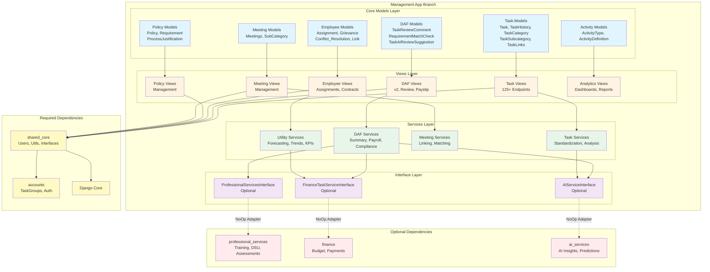
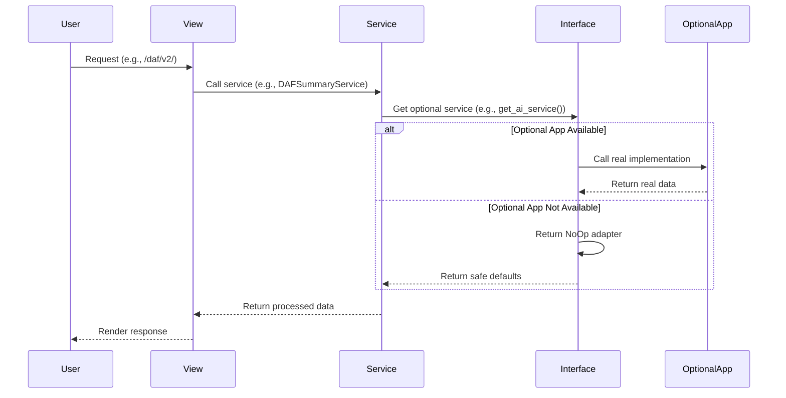
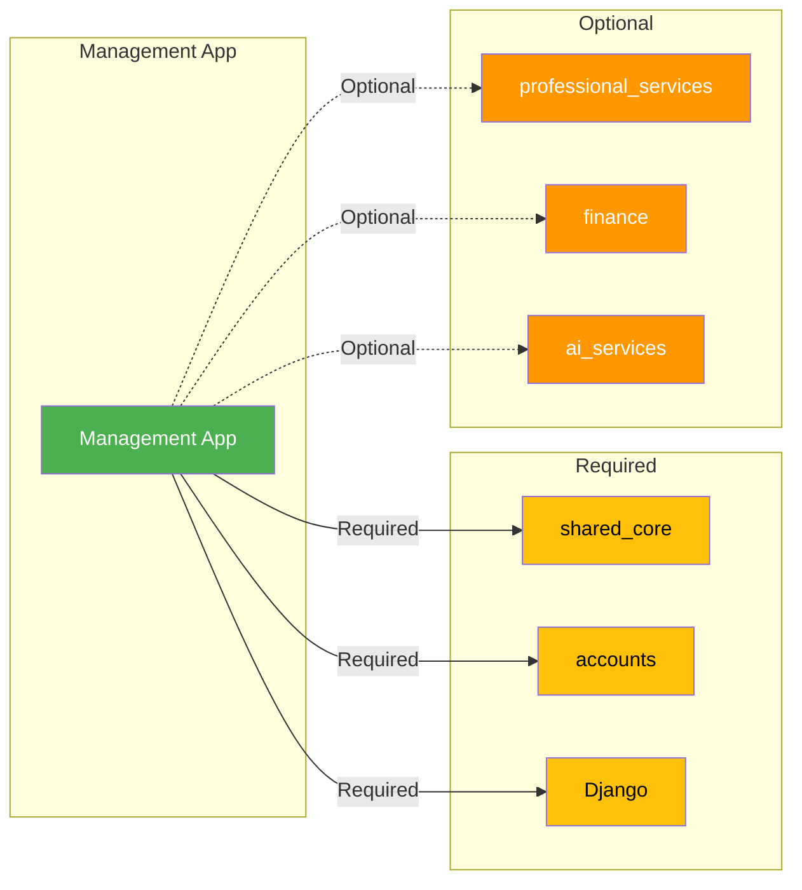

# Management-Only Branch Architecture - Visual Diagram

**Date:** January 3, 2026  
**Purpose:** Visual representation of Management app branch architecture

---

## 🏗️ Architecture Overview Diagram



---

## 📊 Component Breakdown

### Core Models (21 Models)

```
┌─────────────────────────────────────────────────────────┐
│                    Core Models Layer                     │
├─────────────────────────────────────────────────────────┤
│                                                          │
│  Task Management (6 models)                            │
│  ├── Task                                               │
│  ├── TaskHistory                                        │
│  ├── TaskCategory                                       │
│  ├── TaskSubcategory                                    │
│  ├── TaskLinks                                          │
│  └── TaskGroups (from accounts)                         │
│                                                          │
│  Employee Management (4 models)                        │
│  ├── Assignment                                         │
│  ├── Grievance                                          │
│  ├── Conflict_Resolution                                │
│  └── Link                                               │
│                                                          │
│  Policy & Compliance (4 models)                         │
│  ├── Policy                                             │
│  ├── Requirement                                        │
│  ├── ProcessJustification                               │
│  └── ProcessBreakdown                                   │
│                                                          │
│  DAF Models (3 models)                                  │
│  ├── TaskReviewComment                                  │
│  ├── RequirementMatchCheck                              │
│  └── TaskAIReviewSuggestion                             │
│                                                          │
│  Meetings (2 models)                                    │
│  ├── Meetings                                           │
│  └── SubCategory                                        │
│                                                          │
│  Activity Types (2 models)                              │
│  ├── ActivityType                                       │
│  └── ActivityDefinition                                 │
│                                                          │
│  Other (3 models)                                       │
│  ├── Advertisement                                      │
│  ├── EmployeeCareerState                                │
│  └── PerformanceWarning                                 │
│                                                          │
└─────────────────────────────────────────────────────────┘
```

### Views Layer (125+ Endpoints)

```
┌─────────────────────────────────────────────────────────┐
│                    Views Layer                           │
├─────────────────────────────────────────────────────────┤
│                                                          │
│  Task Management                                        │
│  ├── /tasks/ - Task list                                │
│  ├── /task/<id>/ - Task detail                         │
│  ├── /newtask/ - Create task                           │
│  ├── /task/<id>/update/ - Update task                  │
│  └── /task/<id>/delete/ - Delete task                  │
│                                                          │
│  DAF (Daily Activity Form)                             │
│  ├── /daf/v2/ - DAF v2 view                            │
│  ├── /daf/review/ - DAF review                         │
│  ├── /payroll/ - Payslip                               │
│  ├── /api/daf/summary/ - DAF summary API              │
│  └── /newevidence/<taskid> - Evidence submission       │
│                                                          │
│  Employee Management                                    │
│  ├── /employee_contract/ - Employee contracts          │
│  ├── /assignments/ - Assignments                       │
│  ├── /new_grievance/ - Grievances                      │
│  └── /departments/ - Departments                       │
│                                                          │
│  Policy Management                                      │
│  ├── /policy/ - Policies                               │
│  ├── /policies/ - Policy list                          │
│  └── /policy/<id>/update/ - Update policy             │
│                                                          │
│  Meeting Management                                     │
│  ├── /newmeeting/ - Create meeting                     │
│  ├── /meetings/<status> - List meetings                │
│  └── /meeting/<id>/ - Update meeting                   │
│                                                          │
│  Requirements                                           │
│  ├── /requirement/new - Create requirement             │
│  ├── /requirements/ - List requirements                │
│  └── /requirement/<id>/ - Requirement detail           │
│                                                          │
│  Analytics & Reporting                                  │
│  ├── /analytics/ - Analytics dashboard                 │
│  ├── /analytics/forecast/ - Forecasting                │
│  ├── /analytics/trends/ - Trend analysis               │
│  ├── /analytics/compliance/ - Compliance KPIs          │
│  └── /enhanced-dashboard/ - Enhanced dashboard         │
│                                                          │
└─────────────────────────────────────────────────────────┘
```

### Services Layer (41 Services)

```
┌─────────────────────────────────────────────────────────┐
│                   Services Layer                         │
├─────────────────────────────────────────────────────────┤
│                                                          │
│  DAF Services (8 services)                              │
│  ├── DAFSummaryService                                  │
│  ├── DAFCurrentSummaryService                           │
│  ├── DAFPeriodService                                   │
│  ├── PayrollSummaryService                              │
│  ├── ChecklistEvaluationService                         │
│  ├── TaskQualityGateService                             │
│  ├── EvidenceSummaryService                             │
│  └── TaskAIReviewService                                │
│                                                          │
│  Task Services (3 services)                             │
│  ├── TaskStandardizationService                         │
│  ├── TaskHistoryAnalyzer                                │
│  └── ActivityTypeApplicationService                      │
│                                                          │
│  Meeting Services (3 services)                          │
│  ├── MeetingLinkingService                              │
│  ├── MeetingMatchService                                 │
│  └── MeetingTaskReconciliationService                    │
│                                                          │
│  Utility Services (27 services)                         │
│  ├── UtilitiesService                                   │
│  ├── ReleaseEngine                                      │
│  ├── PolicyResolver                                     │
│  ├── DepartmentOptimizationService                       │
│  ├── ForecastingService                                 │
│  ├── TrendAnalysisService                                │
│  ├── ComplianceKPIService                               │
│  ├── AnomalyDetectionService                            │
│  └── ... (19 more services)                             │
│                                                          │
└─────────────────────────────────────────────────────────┘
```

### Interface Layer

```
┌─────────────────────────────────────────────────────────┐
│                  Interface Layer                         │
├─────────────────────────────────────────────────────────┤
│                                                          │
│  ProfessionalServicesInterface                          │
│  ├── list_dsu_for_user()                               │
│  ├── create_or_update_dsu()                            │
│  ├── list_client_assessments()                          │
│  ├── create_client_assessment()                         │
│  ├── list_background_checks()                           │
│  └── create_background_check()                          │
│                                                          │
│  FinanceTaskServiceInterface                            │
│  ├── has_active_loan()                                 │
│  ├── get_user_loan_summary()                           │
│  ├── has_payment_history()                             │
│  ├── get_payslip_config()                              │
│  ├── get_recent_payments_for_user()                     │
│  └── get_budget_suggestion()                            │
│                                                          │
│  AIServiceInterface                                     │
│  ├── generate_pay_explanation()                         │
│  ├── generate_daf_focus()                              │
│  ├── generate_career_coaching()                         │
│  ├── generate_compliance_coaching()                     │
│  └── generate_quality_feedback()                        │
│                                                          │
└─────────────────────────────────────────────────────────┘
```

---

## 🔄 Data Flow Diagram



---

## 🎯 Dependency Graph



---

## 📦 Deployment Scenarios

### Scenario 1: Management-Only

```
┌─────────────────────────────────────┐
│      Management App Branch          │
│                                     │
│  ✅ Core Models (21)                │
│  ✅ Core Views (125+)               │
│  ✅ Core Services (41)              │
│  ⚠️  Optional Features: Disabled      │
│                                     │
│  Dependencies:                      │
│  ✅ shared_core                     │
│  ✅ accounts                        │
│  ✅ Django                          │
│  ❌ professional_services           │
│  ❌ finance                         │
│  ❌ ai_services                     │
└─────────────────────────────────────┘
```

### Scenario 2: Management + Professional Services

```
┌─────────────────────────────────────┐
│      Management App Branch          │
│                                     │
│  ✅ Core Models (21)                │
│  ✅ Core Views (125+)               │
│  ✅ Core Services (41)              │
│  ✅ Training Features               │
│  ✅ DSU Features                     │
│  ✅ Client Assessment Features       │
│                                     │
│  Dependencies:                      │
│  ✅ shared_core                     │
│  ✅ accounts                        │
│  ✅ Django                          │
│  ✅ professional_services           │
│  ❌ finance                         │
│  ❌ ai_services                     │
└─────────────────────────────────────┘
```

### Scenario 3: Full Stack

```
┌─────────────────────────────────────┐
│      Management App Branch          │
│                                     │
│  ✅ Core Models (21)                │
│  ✅ Core Views (125+)               │
│  ✅ Core Services (41)              │
│  ✅ All Optional Features           │
│                                     │
│  Dependencies:                      │
│  ✅ shared_core                     │
│  ✅ accounts                        │
│  ✅ Django                          │
│  ✅ professional_services           │
│  ✅ finance                         │
│  ✅ ai_services                     │
└─────────────────────────────────────┘
```

---

## 🔌 Interface Pattern Flow

```
┌─────────────────────────────────────────────────────────┐
│              Interface Pattern Flow                      │
├─────────────────────────────────────────────────────────┤
│                                                          │
│  1. Service calls helper:                               │
│     pro_services = get_professional_services()          │
│                                                          │
│  2. Helper tries to import:                             │
│     try:                                                 │
│         from professional_services.adapters import ...   │
│         return ProfessionalServicesAdapter()            │
│     except ImportError:                                 │
│         return NoOpProfessionalServicesAdapter()        │
│                                                          │
│  3. Service uses interface:                             │
│     dsu_list = pro_services.list_dsu_for_user('staff')  │
│                                                          │
│  4. Result:                                              │
│     - If available: Real data from professional_services│
│     - If not: Empty list [] (safe default)              │
│                                                          │
└─────────────────────────────────────────────────────────┘
```

---

**Last Updated:** January 3, 2026

